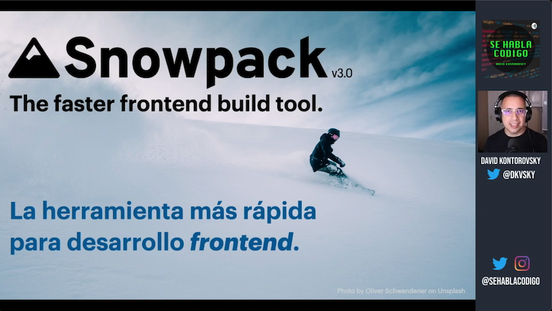

# Presentación de Snowpack

## "La herramienta más rápida para desarrollar frontend"

Este repositorio es complemento del video que subimos a YouTube presentando esta herramienta que nos facilita el trabajo de desarrollo frontend.

<a href="https://youtu.be/M8ERzVkiOWU" target="_blank"></a>

Para usar éste código.

1. Bájalo según el procedimiento usual.
2. Instala Snowpack de manera global:

```bash
npm i snowpack@next -g
```

Nota: Después de Enero 06, 2021 sólo necesitarás correr `npm i snowpack -g`

3. Corre el comando:

```bash
snowpack dev
```
